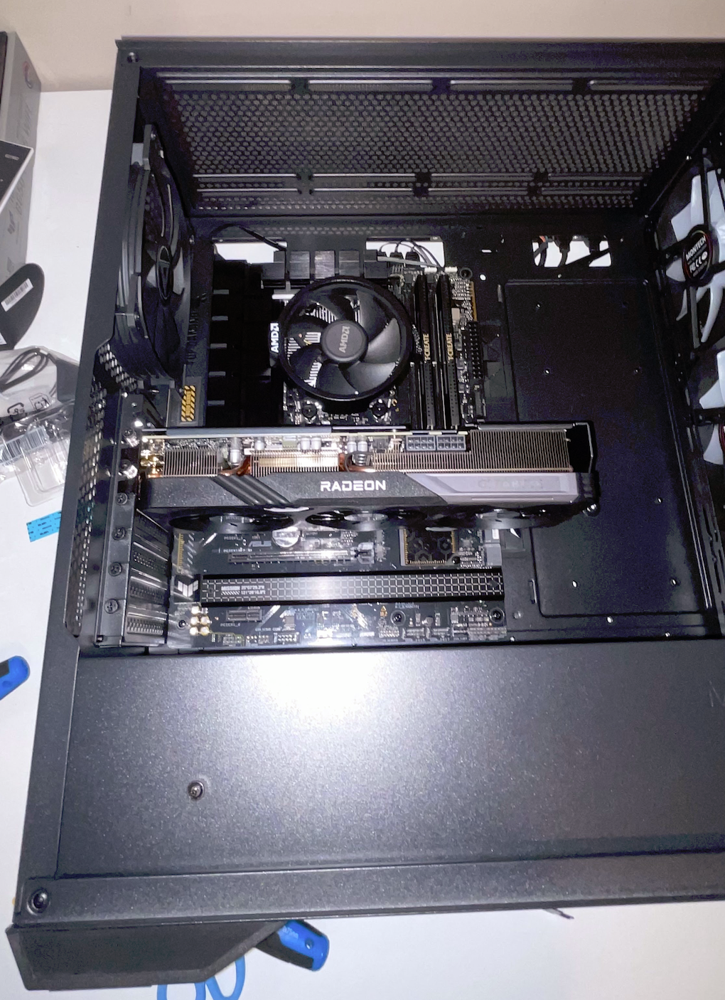
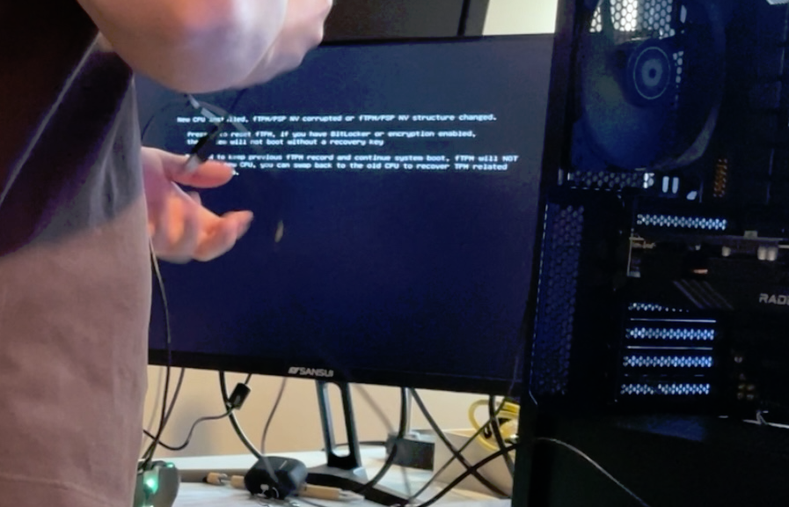

# pc-build-assembly-troubleshooting
A hands-on project documenting the process of assembling, configuring, troubleshooting, and optimizing a custom desktop PC. This includes cable management, hardware installation, BIOS/UEFI configuration, driver setup, operating system installation, and performance tuning.

## **Project Overview**

In this project, I fully assembled and configured a custom desktop PC from an empty case. This lab involved hardware installation, system wiring, BIOS/UEFI configuration, operating system setup, and performance testing. Throughout the build, I identified and resolved hardware conflicts, validated system stability, and fine-tuned settings to ensure optimal operation. This project demonstrates hands-on technical ability with computer hardware, diagnostics, and system optimization.

## **Key Activities Completed**

- Installed and assembled major components (including installing the CPU, CPU fan, RAM, M.2 NVMe SSD, and Radeon GPU)
- Connected and routed all power and data cables
- Configured the BIOS/UEFI
- Validated hardware compatibility
- Installed the operating system
- Troubleshot system errors
- Conducted performance checks

## **Screenshots**

### **1. Motherboard & Power Connection**

Connecting the motherboard with the case and routing power cables.

### **2. GPU Installation**

Proper seating of the Radeon GPU and alignment of the PCIe lane.

### **3. Initial Boot & BIOS Screen**

Captures the system's first successful POST along with BIOS temperature and voltage readings.

### **4. System Warning**

Shows troubleshooting during CPU-related firmware prompt before successful restart.

### **5. Complete Build**

Shows the fully operational system after driver installation, performance checks, and successful desktop boot.

### **6. VM Installation**

Captures the installation of the operating system on a virtual machine after successfully running the computer.

## **Tools & Techniques**
- Hardware Assembly Tools: Screwdrivers, anti-static precautions, cable ties
- System Configuration: BIOS/UEFI configuration, fan tuning, boot priority adjustments
- Diagnostics: POST analysis, TPM/firmware message resolution, driver troubleshooting
- Performance Monitoring: Temperature/fan curve tuning, stability verification
- Software Tools:
    - Windows Installation Media
    - AMD Radeon Drivers
    - Motherboard chipset utilities
    - Monitoring tools for voltage, thermals, and fan performance

## **Purpose**

The purpose of this project was to demonstrate practical experience in PC hardware assembly, system troubleshooting, and performance optimization. It served as a hands-on opportunity to enhance proficiency with internal PC components, BIOS configuration, driver installation, and diagnostic techniques. Successfully completing this build showcases competency in identifying hardware problems, configuring system firmware, and delivering a fully functional, optimized desktop environment.